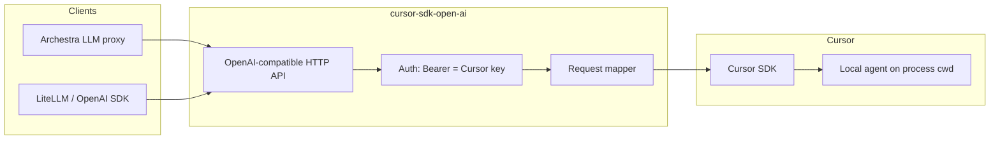

# Architecture

## Context



Archestra (and LiteLLM) treat the gateway as an **OpenAI provider**: base URL + API key. The API key **is** the Cursor API key end-to-end.

## Components

### 1. HTTP API layer

Implements a minimal OpenAI surface:

| Endpoint | Behavior |
|----------|----------|
| `GET /v1/models` | Authenticate → `Cursor.models.list({ apiKey })` → map to OpenAI list format |
| `POST /v1/chat/completions` | Authenticate → map body → SDK run → map result / SSE stream |

Health/readiness endpoints (e.g. `/health`) optional for K8s.

### 2. Authentication

**Primary path (Archestra / OpenAI clients)**

```
Authorization: Bearer cursor_...
```

**Processing**

1. Extract bearer token (or configured alternate header if needed later).
2. Reject empty → `401` OpenAI error object.
3. Pass token to every SDK call as explicit `apiKey` / `api_key` (do not rely on ambient `CURSOR_API_KEY` in multi-tenant mode).

**Fallback (single-tenant dev only)**

- If no bearer token and `CURSOR_API_KEY` is set in the gateway environment, use env key (document as dev-only).

**Archestra setup**

- Provider “OpenAI API key” = user’s or service account **Cursor API key**.
- No separate gateway-issued API key required unless you add an optional second layer later.

### 3. Request mapper (chat completions)

**Input:** OpenAI `messages`, `model`, `stream`, optional `user`, `temperature` (ignore or map if Cursor supports via model params).

**Prompt construction**

- Merge `messages` into a single agent prompt (system + user/assistant history), or maintain session state (see below).
- **v1 default:** stateless — one shot per request via `Agent.prompt(...)` or ephemeral `Agent.create` + `send` + dispose.

**Model**

- `model` must be an id from `Cursor.models.list()` for that key (e.g. `composer-2.5`, `auto`).

**Runtime**

The gateway always uses the Cursor SDK **local** runtime: `local: { cwd: process.cwd(), settingSources: [] }`. Operators choose the workspace by **where the process runs** (host repo root, `docker run -w`, volume mounts), not via environment variables.

**Output**

- Non-stream: OpenAI `chat.completion` with `choices[0].message.content`.
- Stream: SSE chunks with `delta.content` from SDK run stream (assistant text blocks only in v1).
- Include `usage` when available; otherwise omit or estimate and document.

**Errors**

| Condition | HTTP | Notes |
|-----------|------|--------|
| Bad/missing key | 401 | Before SDK |
| `CursorAgentError` (run never started) | 502/503 | Retry hint from `isRetryable` |
| Run finished `status === "error"` | 500 | Run executed but failed |

Log `agent_id` and `run_id` on each completion for support.

### 4. Session mapping (optional, post-v1)

OpenAI clients resend full `messages`; Cursor can reuse **`Agent.create` + `send`** or **`Agent.resume`**.

Optional enhancement:

- Key sessions by OpenAI `user` + Archestra conversation id (header) → store `agent_id`.
- Reduces re-sending huge histories; increases gateway statefulness.

Not required for Archestra MVP if messages are full context each turn.

### 5. Model discovery

```
Client GET /v1/models + Bearer cursor_key
  → Gateway calls Cursor.models.list({ apiKey: cursor_key })
  → Response: { object: "list", data: [ { id, object: "model", owned_by: "cursor", ... } ] }
```

Cache per key (e.g. 5–15 minutes) to rate-limit; invalidate on auth failure.

## LiteLLM relationship

LiteLLM can point at this gateway with:

- `api_base`: gateway URL
- `api_key`: **Cursor API key**
- `model`: id from `/v1/models`

The gateway **is** the compatibility layer; LiteLLM is optional upstream routing, not a hard dependency inside the binary.

## Archestra integration

1. Deploy gateway (container/service) with network path from Archestra to gateway.
2. Archestra custom provider: **OpenAI-compatible**, base URL = gateway, **API key = Cursor API key**.
3. LLM proxy: select models from discovery endpoint.
4. Agents use that proxy; the gateway runs **local** Cursor agents on its process working directory.

**Nested orchestration warning:** Archestra runs an agent loop; Cursor runs another. Architecture assumes the gateway host/container is laid out so `process.cwd()` is the codebase you want Cursor to act on.

## Deployment

| Environment | Workspace | Secrets |
|-------------|-----------|---------|
| Docker | `docker run -w` + volume mount | Cursor key via Bearer / Archestra provider |
| Dev host | Run `pnpm dev` from repo root | Bearer = personal Cursor key |

Gateway should run with explicit disposal of SDK agents (`with` / `await using`) to avoid leaked local executors.

## Security

- Treat bearer tokens as secrets (logs redacted).
- Do not log full message bodies in production unless configured.
- Cloud MCP/stdio env may contain secrets—follow Cursor SDK guidance.
- Prefer team **service account** keys for org-wide Archestra proxies.

## Observability

- Structured logs: `request_id`, `model`, `run_id`, `agent_id`, duration, `status`.
- Metrics: request count, latency histogram, error rate by class (401 vs SDK vs run error).

## Implementation roadmap (suggested)

1. Auth middleware (Bearer → Cursor key)
2. `GET /v1/models`
3. `POST /v1/chat/completions` non-stream (`Agent.prompt`)
4. Streaming SSE
5. Session stickiness (optional)
6. Usage / limits alignment with Archestra

## Deployment

Container images are built and pushed to **GitHub Container Registry** by [`.github/workflows/ci.yml`](../.github/workflows/ci.yml) (`ghcr.io/<owner>/cursor-sdk-open-ai`). Runtime configuration, Docker Compose, and Archestra provider steps are documented in [deployment.md](deployment.md).

## References

- [Cursor SDK (TypeScript / Python)](https://cursor.com/docs/sdk)
- [Cursor models API via SDK](https://cursor.com/docs/sdk) — `Cursor.models.list()`
- OpenAI Chat Completions API shape (compatibility target)
