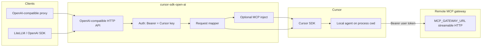

# Architecture

## Context



OpenAI-compatible clients treat the gateway as a provider: base URL + API key. The API key **is** the Cursor API key end-to-end. When **`MCP_GATEWAY_URL`** is configured and the client sends **`X-Mcp-Gateway-Token`**, the gateway attaches an HTTP MCP server to the Cursor agent; Cursor calls the remote gateway with **Bearer** user token (not the Cursor key). Cursor executes tools directly against MCP—not via OpenAI `tools` on this API.

## Components

### 1. HTTP API layer

Implements a minimal OpenAI surface:

| Endpoint | Behavior |
|----------|----------|
| `GET /v1/models` | Authenticate → `Cursor.models.list({ apiKey })` → map to OpenAI list format |
| `POST /v1/chat/completions` | Authenticate → map body → SDK run → map result / SSE stream |

Health/readiness endpoints (e.g. `/health`) optional for K8s.

### 2. Authentication

**Primary path (OpenAI clients)**

```
Authorization: Bearer cursor_...
```

**Processing**

1. Extract bearer token (or configured alternate header if needed later).
2. Reject empty → `401` OpenAI error object.
3. Pass token to every SDK call as explicit `apiKey` / `api_key` (do not rely on ambient `CURSOR_API_KEY` in multi-tenant mode).

**Fallback (single-tenant dev only)**

- If no bearer token and `CURSOR_API_KEY` is set in the gateway environment, use env key (document as dev-only).

**Provider setup**

- Provider “OpenAI API key” = user’s or service account **Cursor API key**.
- Optional: provider extra header **`X-Mcp-Gateway-Token`** = user’s MCP gateway token (Bearer when `MCP_GATEWAY_URL` is set on the gateway).

### 3. Request mapper (chat completions)

**Input:** OpenAI `messages`, `model`, `stream`, optional `user`, `temperature` (ignore or map if Cursor supports via model params).

**Prompt construction**

- **Stateless** (no session id): merge full `messages` into one agent prompt each request.
- **Session stickiness** (when OpenAI `user` or optional `AGENT_SESSION_HEADER` is present): map external session id → Cursor `agent_id`, **`Agent.resume`**, send only the latest user turn; first turn uses full initial prompt.
- Each request uses `Agent.create` / `Agent.resume` + `send` + explicit dispose (no long-lived HTTP connection to the agent handle).

**Model**

- `model` must be an id from `Cursor.models.list()` for that key (e.g. `composer-2.5`, `auto`).

**Runtime**

The gateway always uses the Cursor SDK **local** runtime: `local: { cwd: process.cwd(), settingSources: [] }`. Operators choose the workspace by **where the process runs** (host repo root, `docker run -w`, volume mounts), not via environment variables.

**MCP gateway injection (optional)**

- Env **`MCP_GATEWAY_URL`**: deployment-level streamable HTTP endpoint.
- Per request: header **`X-Mcp-Gateway-Token`** → `mcpServers.gateway` with `type: "http"`, `Authorization: Bearer <token>`.
- If URL is set but header is absent, the agent runs **without** MCP (no 400).
- Logs include `mcp_attached`; tokens are never logged.

See [mcp-gateway.md](mcp-gateway.md).

**Output**

- Non-stream: OpenAI `chat.completion` with `choices[0].message.content` and optional top-level `usage` when the SDK reports token counts.
- Stream: SSE chunks with `delta.content` from SDK run stream (assistant text blocks in v1). When `STREAM_IDLE_HEARTBEAT_SECONDS` > 0, emit minimal invisible keepalive content during SDK silence so upstream clients detect progress during long tool runs.
- Stream usage: when the client sets `stream_options.include_usage: true`, or when the SDK reports usage, emit a trailing usage chunk after `finish_reason: stop`.
- Response headers: `X-Cursor-Gateway-Mcp-Attached`, and `X-Cursor-Gateway-Likely-Double-Orchestration` when MCP is attached and the request already contains `tool` role messages (upstream tool loop + Cursor MCP).
- Omit `usage` when the SDK does not report counts (non-stream and stream).

**Errors**

| Condition | HTTP | Notes |
|-----------|------|--------|
| Bad/missing key | 401 | Before SDK |
| `CursorAgentError` (run never started) | 502/503 | Retry hint from `isRetryable` |
| Run finished `status === "error"` | 500 | Run executed but failed |

Log `agent_id`, `run_id`, `external_session_id`, and `session_resumed` on each completion for support.

### 4. Session mapping

OpenAI clients often resend full `messages` on every hop. When a stable **external session id** is provided, the gateway reuses Cursor agents via **`Agent.resume`**.

**Session id sources** (first non-empty):

1. Request header named by **`AGENT_SESSION_HEADER`** (optional env; unset = skip).
2. OpenAI **`user`** field on the chat completion body.

**In-memory store** (per process): `agent_id` keyed by hash(Cursor API key) + external session id + model. TTL and max entries via `AGENT_SESSION_TTL_SECONDS` and `AGENT_SESSION_MAX_ENTRIES`. Concurrent requests for the same session are serialized.

If resume fails (agent missing on disk), the gateway creates a new agent and re-seeds the session.

**Stateless:** omit both session id sources → full prompt every request, no map entry.

### 5. Model discovery

```
Client GET /v1/models + Bearer cursor_key
  → Gateway calls Cursor.models.list({ apiKey: cursor_key })
  → Response: { object: "list", data: [ { id, object: "model", owned_by: "cursor", ... } ] }
```

Cache per key (e.g. 5–15 minutes) to rate-limit; invalidate on auth failure.

## LiteLLM relationship

LiteLLM can point at this gateway with:

- `api_base`: gateway URL
- `api_key`: **Cursor API key**
- `model`: id from `/v1/models`

The gateway **is** the compatibility layer; LiteLLM is optional upstream routing, not a hard dependency inside the binary.

## Upstream OpenAI-compatible integration

1. Deploy the gateway where clients can reach it.
2. Custom provider: **OpenAI-compatible**, base URL = gateway, **API key = Cursor API key**.
3. Optional MCP: **`MCP_GATEWAY_URL`** on gateway + **`X-Mcp-Gateway-Token`** per user ([mcp-gateway.md](mcp-gateway.md)).
4. Select models from `/v1/models`.

**Nested orchestration:** some upstream clients run their own tool loop before each completion call; Cursor may run another when MCP is injected. Prefer one orchestrator per agent. Session stickiness (OpenAI `user` or optional session header) reduces repeated full-history prompts.

## Deployment

| Environment | Workspace | Secrets |
|-------------|-----------|---------|
| Docker | `docker run -w` + volume mount | Cursor key via Bearer |
| Dev host | Run `pnpm dev` from repo root | Bearer = personal Cursor key |

The gateway disposes SDK agents per request (`await using`) to avoid leaked local executors.

## Security

- Treat bearer tokens as secrets (logs redacted).
- Do not log full message bodies in production unless configured.
- Cloud MCP/stdio env may contain secrets—follow Cursor SDK guidance.
- Prefer team **service account** keys for org-wide provider configuration.

## Observability

- Structured logs: `request_id`, `model`, `run_id`, `agent_id`, `external_session_id`, `session_resumed`, `mcp_attached`, `likely_double_orchestration`, `status`.

## Implementation status

Core OpenAI surface, streaming, session stickiness, MCP injection, and usage mapping are implemented. Future work may include async/job completions and richer metrics export.

## Container images

Container images are built and pushed to **GitHub Container Registry** by [`.github/workflows/ci.yml`](../.github/workflows/ci.yml). Runtime configuration and Docker Compose are documented in [deployment.md](deployment.md).

## References

- [Cursor SDK (TypeScript / Python)](https://cursor.com/docs/sdk)
- [Cursor models API via SDK](https://cursor.com/docs/sdk) — `Cursor.models.list()`
- OpenAI Chat Completions API shape (compatibility target)
